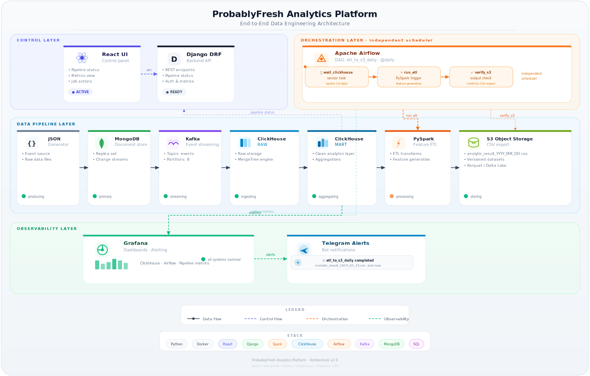

# ProbablyFresh Analytics Platform

`ProbablyFresh` — учебно-практический Data Engineering проект с полным контуром:

`JSON -> MongoDB -> Kafka -> ClickHouse RAW -> ClickHouse MART -> PySpark ETL -> S3`

<p align="center">
  
</p>

Дополнительно:
- Grafana (дашборды и алерты),
- Airflow (ежедневный DAG),
- Django + DRF backend API,
- React frontend control panel.

## Quickstart (кратко)

1. Подготовить `.env` вручную из `.env.example` (не перезаписывать существующий).
2. Поднять стек Docker.
3. Дождаться `SELECT 1` от ClickHouse.
4. Применить SQL в строгом порядке: `01_init.sql` -> `02_mart.sql`.
5. Запустить: `generate_data` -> `load_to_mongo` -> `produce_from_mongo --once`.
6. Повторно применить `02_mart.sql` для snapshot качества.
7. Запустить ETL (`spark-submit jobs/features_etl.py` в `app` контейнере, по умолчанию CSV-only).
8. Проверить smoke-check, Grafana, Airflow, UI/API.

Подробный сценарий и команды: `RUNBOOK_DOCKER.md`.

## Что это за проект

Платформа имитирует реальную работу с заказчиком: от приема сырых данных до очистки, витринных метрик, feature-матрицы и выгрузки результата в объектное хранилище.

Сейчас это уже не только pipeline-репозиторий, но и полноценный control panel:
- с ручными one-click действиями для основных шагов пайплайна;
- с managed ingestion/staging слоем, batch-статусами, ошибками и replay;
- с UI для feature mart, exports, качества данных и документации;
- с metadata-driven drill-down по feature mart, где можно открыть описание фичи, логику расчёта, окна и пороги.

## Архитектура (1 блок)

```text
JSON files
  -> MongoDB
  -> Kafka topics
  -> ClickHouse RAW
  -> ClickHouse MART
  -> PySpark features ETL
  -> S3 (CSV by default, optional Parquet)

Monitoring/Control:
  Grafana + Telegram alerts
  Airflow DAG (etl_to_s3_daily)
  Django API + React UI
```

## Основные сервисы (`docker-compose.yml`)

- `zookeeper`, `kafka` — транспорт событий.
- `mongodb` — источник документов.
- `clickhouse` — RAW/MART аналитический слой.
- `app` — запуск Python/Spark задач.
- `grafana` — мониторинг и алертинг.
- `airflow-postgres`, `airflow` — оркестрация DAG.
- `backend` — API и управление job-run.
- `frontend` — UI control panel.

## Ключевые части пайплайна

- Генерация данных: `src/generator/generate_data.py`
- Загрузка в MongoDB: `src/loader/load_to_mongo.py`
- Публикация в Kafka: `src/streaming/produce_from_mongo.py`
- PII (актуально): `SHA-256 + salt` (one-way hash) в `src/probablyfresh/core/crypto_utils.py`
- RAW init: `docker/clickhouse/init/01_init.sql`
- MART init: `docker/clickhouse/init/02_mart.sql`
- ETL (30 бинарных признаков): `jobs/features_etl.py`
- Backend job runner + imports: `backend/api/services/actions.py`, `backend/api/services/imports.py`
- Проверки: `scripts/smoke_check.py`, `scripts/pii_hash_selfcheck.py`

### Экспорт результатов ETL

- По умолчанию `jobs/features_etl.py` формирует и загружает только CSV.
- Parquet поддерживается как дополнительный формат, но выключен по умолчанию, потому что заметно замедляет ETL.
- Включение Parquet:

```bash
FEATURES_EXPORT_PARQUET=1 spark-submit jobs/features_etl.py
```

При включении флага ETL сохраняет обычный CSV и дополнительно выгружает parquet dataset со `snappy` compression.

## Что доступно в UI

- `Overview` — KPI, ingestion activity, services health, платежный breakdown и последние запуски.
- `Pipelines` — one-click действия, managed ingestion, staging и replay batch.
- `Data Quality` — duplicate ratio, trend и MART quality stats.
- `Feature Mart` — summary признаков, drill-down с определениями фич и раскрываемая таблица customer-by-feature.
- `Exports` — список файлов в S3-compatible storage.
- `Settings` — Safe Mode и overview подключений.
- `About Project` — краткое описание платформы и архитектуры.
- `Documentation` — встроенная справочная страница, открываемая из шапки в отдельной вкладке.

## Почему в проекте используются Bash-команды

Проект полностью работает в Docker-контуре, а Airflow используется как оркестратор шагов, а не как вычислительный движок.  
Поэтому в DAG и runbook часто применяются shell-команды и `BashOperator`: это стандартный способ управлять контейнерной инфраструктурой и запускать уже готовые сервисные задачи.

Типовые операции, которые удобно и корректно делать через Bash:
- `docker compose` / `docker exec` для запуска задач внутри нужного контейнера;
- `curl` / `ping` / циклы ожидания для проверки готовности сервисов;
- запуск ETL в `app`-контейнере (Python/Spark job в той же среде, где он отлажен);
- инфраструктурные smoke-проверки и проверка результата в S3.

Архитектурная логика запуска:

```text
Airflow
  -> BashOperator
  -> docker exec
  -> app container
  -> Python / Spark job
```

Такой подход обеспечивает переносимость и повторяемость: Airflow управляет порядком и расписанием, а тяжелые вычисления выполняются в специализированных runtime (Spark/Python jobs).

## Структура репозитория (кратко)

- `src/` — генератор, загрузчик, producer, core-модули.
- `docker/clickhouse/init/` — SQL инициализация RAW/MART.
- `jobs/` — PySpark ETL.
- `scripts/` — smoke/self-check скрипты.
- `airflow/dags/` — DAG `etl_to_s3_daily`.
- `backend/` — Django + DRF API.
- `frontend/` — React + TS UI.
- `demo-preview/` — автономный оффлайн preview интерфейса для демонстрации без запуска инфраструктуры.
- `grafana/` и `docker/grafana/` — provisioning и dashboard.

## Standalone Demo Preview UI

Для быстрого показа интерфейса без backend/Docker/npm доступна отдельная демо-версия:

- файл: `demo-preview/index.html` (полностью автономный, inline CSS/JS);
- запуск: открыть файл напрямую в браузере или через Live Server;
- описание и возможности: `demo-preview/README.md`.

## Документация

- Подробный запуск и проверки: `RUNBOOK_DOCKER.md`
- Полное описание системы: `PROJECT_OVERVIEW.md`
- План развития: `ROADMAP.md`
